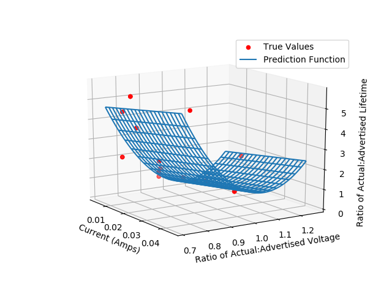

# lamp-life-expectancy
Uses polynomial regression in scikit-learn to create a model for predicting the ratio of the advertised lifetime of a lamp to the actual lifetime based on the observed current and voltage.

Data is sourced from: F.G. Rosillo and N.M. Chivelet (2009). "Lifetime Prediction of Fluorescent Lamps Used in Photovoltaic Systems," Lighting Research and Technology, Vol. 41, #2, pp.183-197.

Here's an example plot (note the actual plot generated by the program is a pannable/zoomable 3D plot!)
